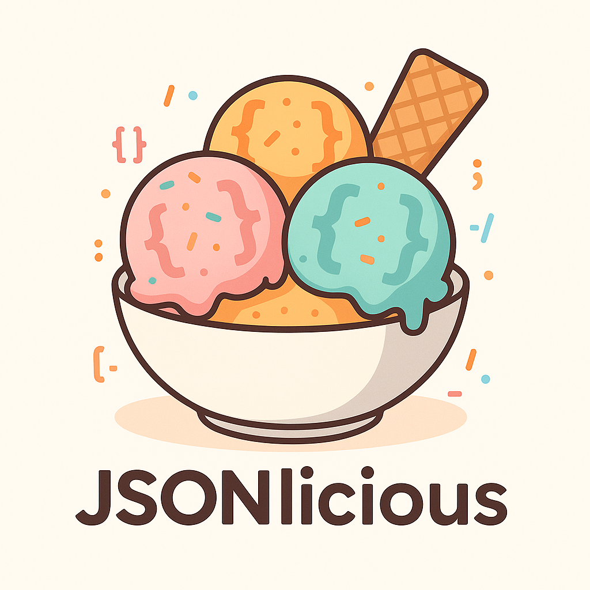
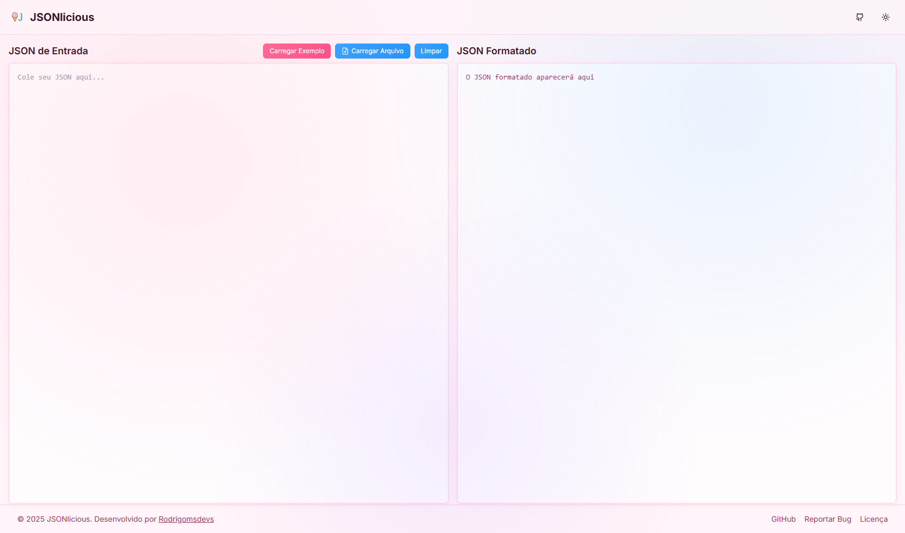

<div align="center">
  
  <h1>JSONlicious</h1>
  <p>Um formatador e validador de JSON bonito e poderoso</p>
  
  <p>
    <a href="https://github.com/Rodrigomsdevs/jsonlicious.com/blob/main/LICENSE">
      
    </a>
    <a href="https://github.com/Rodrigomsdevs/jsonlicious.com/stargazers">
      
    </a>
    <a href="https://github.com/Rodrigomsdevs/jsonlicious.com/network/members">
      
    </a>
    <a href="https://github.com/Rodrigomsdevs/jsonlicious.com/issues">
      
    </a>
  </p>
  
  <p>
    <a href="https://jsonlicious.com">Ver Demo</a>
    ·
    <a href="https://github.com/Rodrigomsdevs/jsonlicious.com/issues/new?labels=bug&template=bug_report.md">Reportar Bug</a>
    ·
    <a href="https://github.com/Rodrigomsdevs/jsonlicious.com/issues/new?labels=enhancement&template=feature_request.md">Solicitar Recurso</a>
  </p>
</div>

## 📋 Índice

- [Sobre o Projeto](#-sobre-o-projeto)
- [Demonstração](#-demonstração)
- [Recursos](#-recursos)
- [Tecnologias](#-tecnologias)
- [Começando](#-começando)
  - [Pré-requisitos](#pré-requisitos)
  - [Instalação](#instalação)
- [Contribuindo](#-contribuindo)
- [Licença](#-licença)
- [Contato](#-contato)
- [Agradecimentos](#-agradecimentos)

## 🚀 Sobre o Projeto

**JSONlicious** é um formatador e validador de JSON online, gratuito e de código aberto. Projetado para ser bonito, rápido e fácil de usar, o JSONlicious oferece uma experiência agradável para trabalhar com dados JSON.

Seja você um desenvolvedor que precisa formatar rapidamente um JSON para depuração, ou alguém que precisa validar a estrutura de um documento JSON, o JSONlicious tem tudo o que você precisa em uma interface limpa e intuitiva.

## 🖼️ Demonstração

<div align="center">
  
</div>

## ✨ Recursos

- ✅ **Formatação de JSON** com indentação adequada
- ✅ **Validação de JSON** com mensagens de erro claras
- ✅ **Visualização em árvore** interativa com indicadores de tipo e tamanho
- ✅ **Copiar para a área de transferência** com um clique
- ✅ **Múltiplos temas**:
  - 🌞 Claro
  - 🌙 Escuro
  - 🌌 Interestelar (tema espacial)
  - 🍦 JSONlicious (tema inspirado em sorvete)
- ✅ **Upload de arquivos** JSON
- ✅ **Download** do JSON formatado
- ✅ **Design responsivo** para todos os dispositivos
- ✅ **Interface em português** (pt-BR)

## 🛠️ Tecnologias

O JSONlicious é construído com tecnologias modernas:

- [Next.js 15](https://nextjs.org/) - Framework React com renderização do lado do servidor
- [React](https://reactjs.org/) - Biblioteca JavaScript para construção de interfaces
- [TypeScript](https://www.typescriptlang.org/) - Superset tipado de JavaScript
- [Tailwind CSS v3](https://tailwindcss.com/) - Framework CSS utilitário
- [Radix UI](https://www.radix-ui.com/) - Componentes de UI primitivos e acessíveis

## 🏁 Começando

Para obter uma cópia local em funcionamento, siga estas etapas simples.

### Pré-requisitos

- Node.js (versão 18.0.0 ou superior)
- npm ou yarn

### Instalação

1. Clone o repositório:
  ```sh
  git clone https://github.com/Rodrigomsdevs/jsonlicious.com.git
  ```

2. Navegue até o diretório do projeto:
  ```sh
  cd jsonlicious.com
  ```

3. Instale as dependências:
  ```sh
  npm install
  # ou
  yarn install
  ```

4. Inicie o servidor de desenvolvimento:
  ```sh
  npm run dev
  # ou
  yarn dev
  ```

5. Abra [http://localhost:3000](http://localhost:3000) no navegador para visualizar o projeto.

## 🤝 Contribuindo

Contribuições são o que tornam a comunidade de código aberto um lugar incrível para aprender, inspirar e criar. Qualquer contribuição que você fizer será **muito apreciada**.

1. Faça um Fork do projeto
2. Crie sua Feature Branch (`git checkout -b feature/AmazingFeature`)
3. Commit suas mudanças (`git commit -m 'Add some AmazingFeature'`)
4. Push para a Branch (`git push origin feature/AmazingFeature`)
5. Abra um Pull Request

## 📄 Licença

Distribuído sob a licença MIT. Veja `LICENSE` para mais informações.

## 📧 Contato

Rodrigomsdevs - [@Rodrigomsdevs](https://github.com/Rodrigomsdevs)

Link do Projeto: [https://github.com/Rodrigomsdevs/jsonlicious.com](https://github.com/Rodrigomsdevs/jsonlicious.com)

## 🙏 Agradecimentos

- [Next.js](https://nextjs.org/)
- [Tailwind CSS](https://tailwindcss.com/)
- [Radix UI](https://www.radix-ui.com/)
- [Lucide Icons](https://lucide.dev/)
- Todos os contribuidores e apoiadores do projeto

---

<div align="center">
  <p>Feito com ❤️ por <a href="https://github.com/Rodrigomsdevs">Rodrigomsdevs</a></p>
  <p>
    <a href="https://jsonlicious.com">jsonlicious.com</a>
  </p>
</div>
